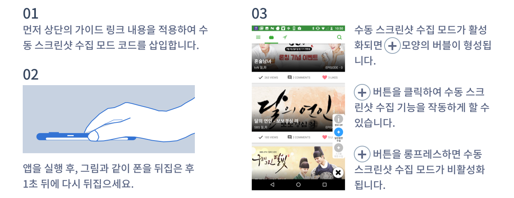

# 스크린샷 취득하기

유저해빗에서는 화면을 수집하기 위해 Test 모드에서 실행된 앱에서 스크린샷을 직접 취득합니다. 앱을 실행하면 화면이 로드된 후 약 1초 내 스크린샷 정보를 자동으로 취득합니다. 하지만, 네트워크를 통한 데이터 처리시 등 일부 화면이 다 출력되기 전에 해당 기능이 동작해 스크린샷이 제대로 수집되지 않는 경우가 있습니다.

이러한 경우를 대비해 아래 스크린샷 수집 방법을 추가로 제공하고 있습니다. 

> **주의!**
화면 해상도가 다른 일부 기기에서는 스크린샷 수집이 제한적일 수 있습니다.

## **1. 코드를 통한 수집 방법**

화면의 출력이 완료되는 시점에 해당 함수를 적용하세요. 함수가 호출되는 순간 스크린샷을 수집합니다.
(스크린샷 수집은 Test 모드에서만 유효하며 한 세션당 한 번의 함수 호출만이 유효 합니다.)

또한, 지정된 매개변수(true/false)에 따라 웹에서 지정한 스크린샷 취득 규칙을 적용 합니다.

```jsx
public class MainActivity extends AppCompatActivity {

  @Override
  protected void onCreate(Bundle savedInstanceState) {
      super.onCreate(savedInstanceState);
      setContentView(R.layout.activity_main);
      server.getNetworkData(mNoticeListener);
  }

  OnResponseListener mNoticeListener = new OnResponseListener() {
      @Override
      public void onSuccessed(int statusCode, JSONObject response) {   
         // true : 웹에서 지정된 설정을 무시하고 수집한다. false : 웹에서 지정된 설정에 따른다. 
      Userhabit.takeScreenshot(true);
      }
  };

}
```

## 2. 수동 스크린샷 수집모드 활용 (BETA)

👉🏻 [디버그 모드 활성화 하기](/docs/sdk/android/activate-debug.html) 함수를 활성화하고 아래 퍼미션을 추가합니다. 

앱이 실행된 기기를 후면 카메라가 보이도록 뒤집고 1초 뒤에 다시 화면이 보이도록 뒤집으면 스크린샷 수집을 위한 화면이 실행됩니다.

> **주의!**
해당 기능을 위해서는 '화면 위에 그리기' 권한이 필요합니다. 해당 권한을 허용해주세요.

```jsx
<?xml version="1.0" encoding="utf-8"?>
<manifest xmlns:android="http://schemas.android.com/apk/res/android"
   package="io.userhabit.myapplication2.app" >
      <uses-permission android:name="android.permission.SYSTEM_ALERT_WINDOW" /> 
</manifest>
```



위의 이미지와 같이 정상적으로 실행이 되면 앱 화면 오른쪽 하단에 ➕ 버튼이 나옵니다.

- **화면 수집 관련 도움 뷰** : '정보 off' 버튼을 클릭하면 상단에 현재 화면 명칭과 스크린샷 수집 현황 정보가 출력됩니다.
- **일반 화면 수집** : 현재 화면의 스크린샷을 수집합니다.
- **스크롤 화면 수집** : 해당 화면에 스크롤이 등록되어 있는 경우 활성화 되며, 스크롤에 해당하는 스크린샷을 수집합니다.