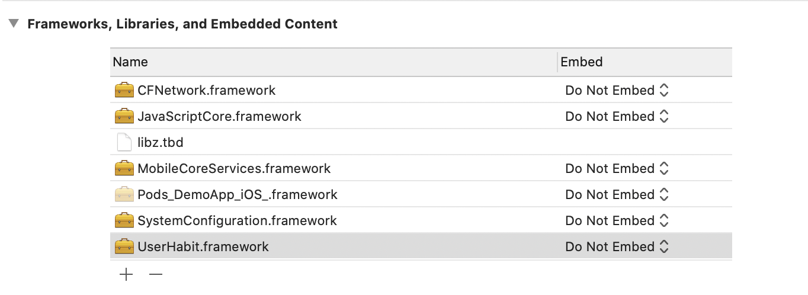

# SDK 적용하기

## 1. **라이브러리 추가하기**

아래 방식 중 개발환경에 맞는 메뉴를 선택해서 적용해주세요.*(메뉴 왼쪽의 ▶︎버튼을 누르면 메뉴가 펼쳐집니다.)*

- **Download 방식**
    1. [링크](https://s3-ap-northeast-1.amazonaws.com/userhabit-production/sdks/UserHabit.framework_1.1.15.zip)를 클릭해 iOS용 유저해빗 SDK를 다운로드 하세요.
    2. 아래의 예시와 같이 관련 Frameworks(UserHabit, CFNetwork, MobileCoreService, WebKit, libz)들을 iOS 프로젝트 Linked Frameworks and Libraries에 추가합니다.

        

    3. 해당 파일의 local 경로를 Project/Build Setting/Framework Search Paths에 추가합니다.
- **CocoaPods 방식**

    Podfile에 `pod 'UserHabitSDK'`을 추가하고 pod install을 실행해주세요.

    해당 파일의 local 경로를 Project/Build Setting/Framework Search Paths 에 추가합니다.

## 2. **소스 코드 추가하기**

1. 로그인 후 UserHabit 콘솔에서 앱을 등록하고 Test API 키와 Production API 키를 발급 받습니다.
2. AppDelegate 파일에서 아래의 부분에 알맞은 API 키를 입력하여 코드를 삽입합니다. Window가 할당된 이후에 코드가 삽입되어야 액션 수집이 가능합니다.

```objectivec
#import <UserHabit/UserHabit.h>

@implementation AppDelegate

- (BOOL)application:(UIApplication *)application didFinishLaunchingWithOptions:(NSDictionary *)launchOptions {

  [UserHabit SessionStart:@"YOUR-API-KEY" withAutoTracking:true];

  return YES;
}
```